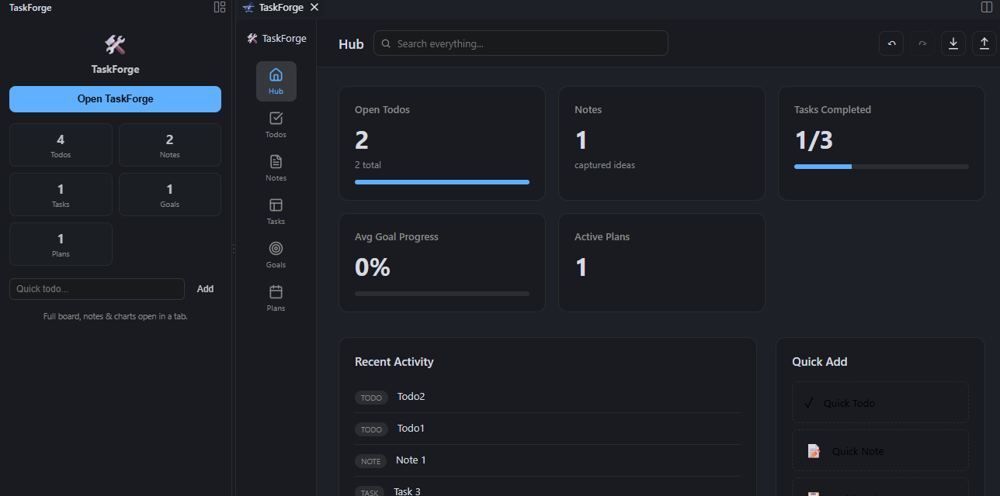
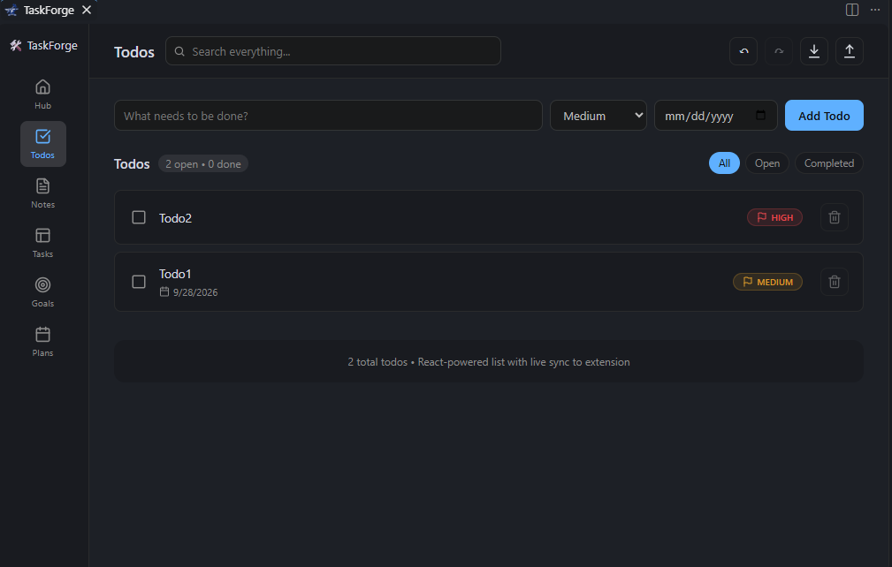
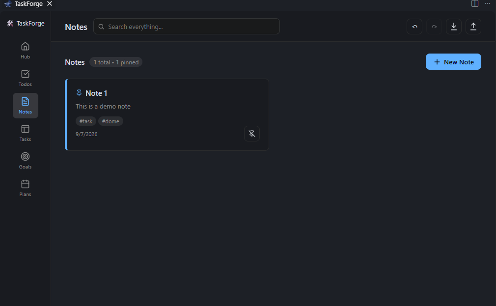
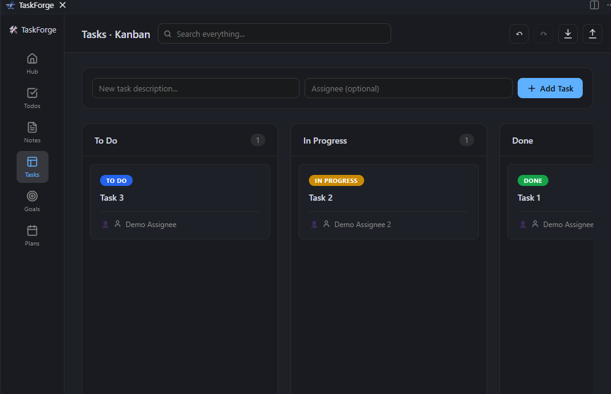
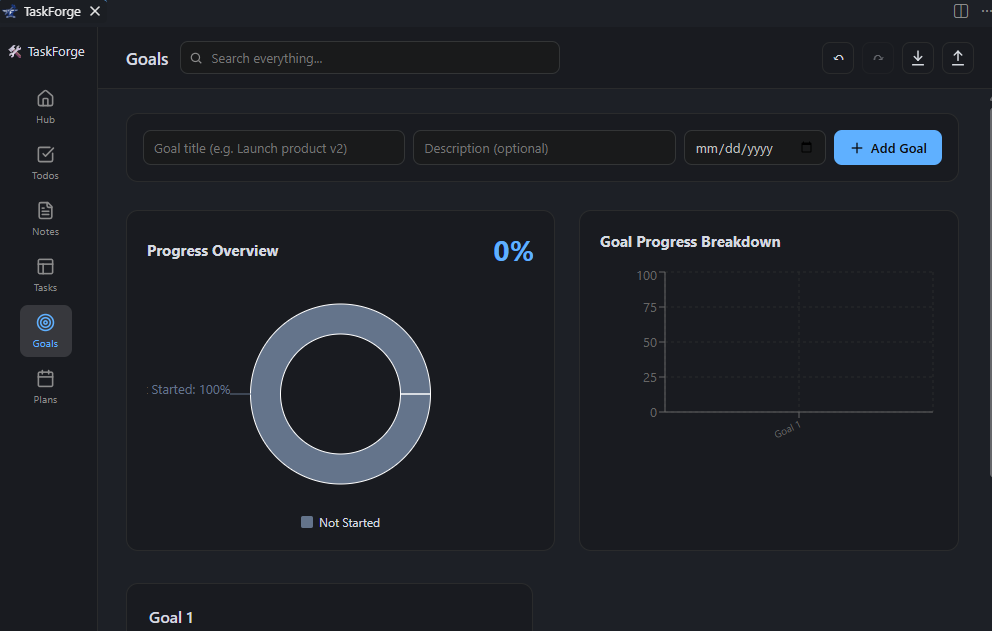
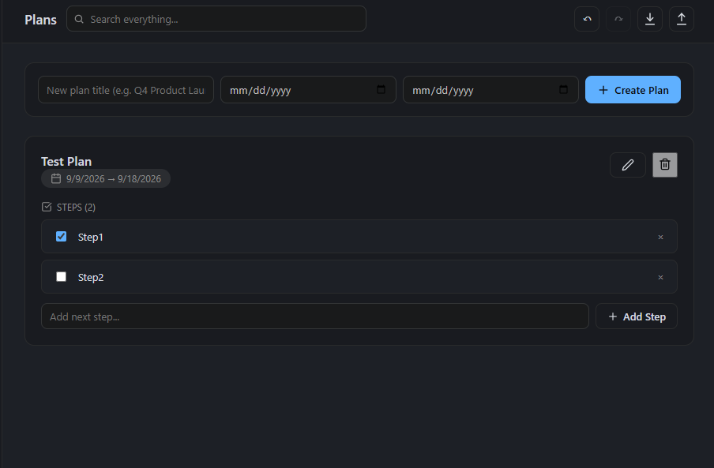

# TaskForge 🛠️

[](https://github.com/AnandShah10/TaskForge/stargazers)
[](https://github.com/AnandShah10/TaskForge/issues)
[](LICENSE)
[](https://code.visualstudio.com/)

**A customizable productivity forge for tasks, todos, notes, goals, and plans with Kanban boards, progress charts, and seamless Git sync.**

*Built with love for the developer community to boost productivity without leaving VS Code.*

## ✨ Features

- **🏠 Hub**: At-a-glance summaries, counts, and one-click quick actions for everything.
- **✅ Todos**: Priorities, due dates, tags, overdue warnings, and in-app delete confirmation.
- **📝 Notes**: Pinned notes, tags, a focused create/edit workspace, and live Markdown preview with formatting support (no external deps).
- **📋 Kanban Tasks**: Fully interactive drag-and-drop Kanban board for tasks with statuses and priorities.
- **🎯 Goals**: Progress tracking with sliders, deadlines, and a beautiful dashboard with charts.
- **🗺️ Plans**: Structured plans with descriptions, timelines, reorderable step checklists, and confirmed delete actions.
- **🔍 Global Search**: Instantly search across todos, notes, tasks, goals, and plans.
- **☁️ Git Sync**: One-click export to `.taskforge.json` (auto-sync option available). Commit to Git for backup and cross-device sync.

## 📸 Screenshots

TaskForge is designed to sit naturally inside VS Code. The screenshots below are shown at full reading width so the navigation, controls, and item details are easy to inspect.

### Hub and Todos

<p align="center">
  
</p>
<p align="center"><strong>Hub overview</strong> for a quick read on activity and progress.</p>

<p align="center">
  
</p>
<p align="center"><strong>Todos</strong> with priorities, due dates, filters, and direct delete actions.</p>

### Notes and Tasks

<p align="center">
  
</p>
<p align="center"><strong>Notes</strong> with pinned cards, tags, Markdown content, and focused editing.</p>

<p align="center">
  
</p>
<p align="center"><strong>Kanban tasks</strong> with drag-and-drop status columns and assignees.</p>

### Goals and Plans

<p align="center">
  
</p>
<p align="center"><strong>Goals</strong> with progress charts, deadlines, and compact card actions.</p>

<p align="center">
  
</p>
<p align="center"><strong>Plans</strong> with timelines, checklist steps, and confirmed deletion.</p>

## 🚀 Getting Started

1. Install **TaskForge** from the [VS Code Marketplace](https://marketplace.visualstudio.com/items?itemName=AnandShah.taskforge).
2. Click the **TaskForge** icon (🛠️) in the Activity Bar to open the sidebar.
3. Use the toolbar `+` buttons in each view or the Command Palette (`Ctrl/Cmd+Shift+P` → "TaskForge: Add Todo" etc.). Delete actions are available directly on item cards and ask for confirmation inside the app.
4. **Kanban**: Click "Open Kanban Board" from Tasks view or run the command.
5. **Goals Chart**: Click "View Goals Dashboard" from Goals view.

**Pro tip**: Use the search command for quick access across all data types.

### Notes workflow

Select **New Note** to open the focused note workspace. Add a title, optional tags, and pin status, then write in Markdown or switch to **Preview** before creating or saving the note. Notes can also be opened and edited by selecting an existing note card.

## ⚙️ Settings

```json
{
  "taskForge.autoGitSync": false,
  "taskForge.maxItems": 100
}
```

- **`taskForge.autoGitSync`**: If enabled, automatically exports data to `.taskforge.json` when adding todos.
- **`taskForge.maxItems`**: Maximum items to keep per category (oldest trimmed automatically).

## 💾 Git Sync Workflow

1. Run **TaskForge: Export to Git** (creates/updates `.taskforge.json` in your workspace).
2. Commit the file to your Git repository.
3. On another machine or after pull, run **TaskForge: Import from Git**.
4. Enable auto sync in settings for convenience.

Data is always available locally via VS Code global storage.

## 🛠️ Development

```bash
npm install
npm run compile
# Press F5 to launch Extension Development Host
```

- Lint: `npm run lint`
- Package: `npm run package` (or `npx @vscode/vsce package`)
- See [webpack.config.js](webpack.config.js) for build setup.

## 📋 Changelog

See [CHANGELOG.md](CHANGELOG.md) for version history.

## 📄 License

This project is licensed under the MIT License - see the [LICENSE](LICENSE) file for details.

---

**Made with ❤️ by Anand Shah for the developer community.**

If you find TaskForge useful, please star the [GitHub repo](https://github.com/AnandShah10/TaskForge). Contributions, issues, and feature requests are welcome!